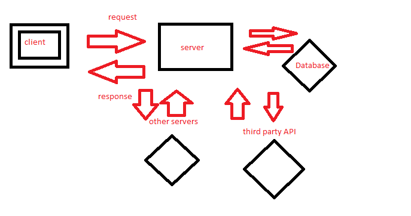

# server-deployment-practice

# server-deployment-practice

## URLs :
## Heroku applications :
server-deploy-dev

server-deploy-prod

## Github actions:
[actions]()

## pull request:
[Pull Request]()

## WRRC diagram

## Drawings:
### WRRC diagram (web request response cycle)

